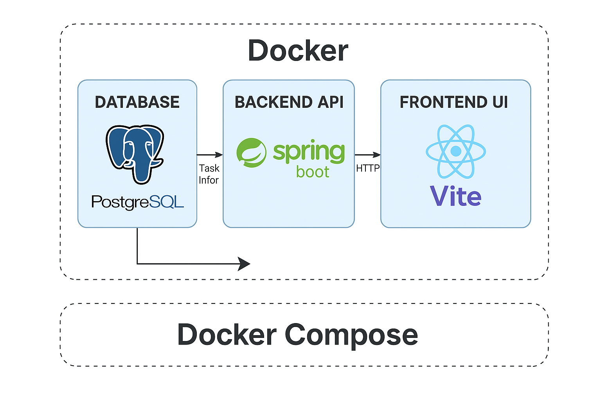
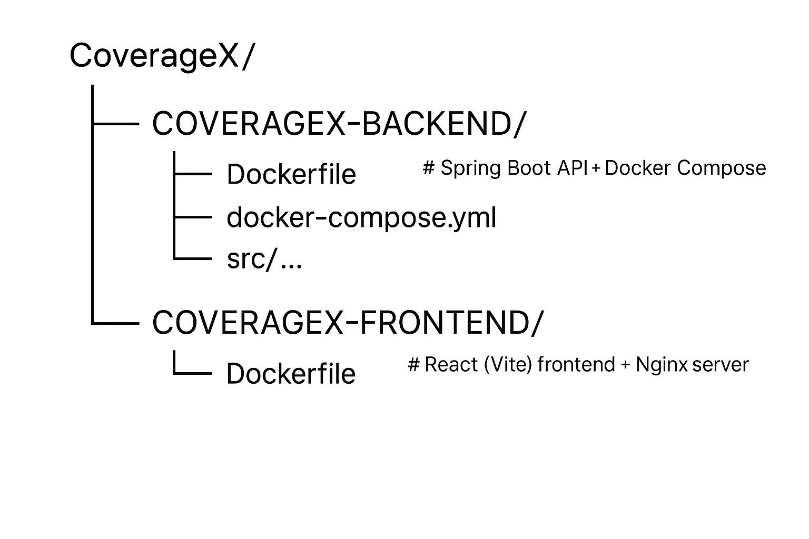

# CoverageX – Full Stack To-Do Web Application

This project is a small to-do list web application built for the **Full Stack Engineer Take-Home Assessment**.  
It lets users add tasks, view only the five most recent incomplete tasks, and mark tasks as completed.  
All components run together in Docker using Docker Compose.

---

## 1. Project Overview

The system has three main parts:

1. **Database** – PostgreSQL stores all task information.  
2. **Backend API** – Java Spring Boot built with Maven. It provides REST API endpoints to create, list, and complete tasks.  
3. **Frontend UI** – React (Vite) single-page application served through Nginx.

---

## 2. Key Features

- Create a new task with a title and description  
- Display only the five most recent incomplete tasks  
- Mark a task as done so it disappears from the list  
- Containerized backend, frontend, and database using Docker Compose  
- Example integration and unit tests included  

---

## Architecture


## Folder Structure



---

## 4. Prerequisites

- Docker Desktop or Docker Engine with Compose v2  
- Internet access for the first build (to pull images and dependencies)

---

## 5. How to Run

Open a terminal and run the following commands:

```bash
cd COVERAGEX-BACKEND
docker compose up --build
